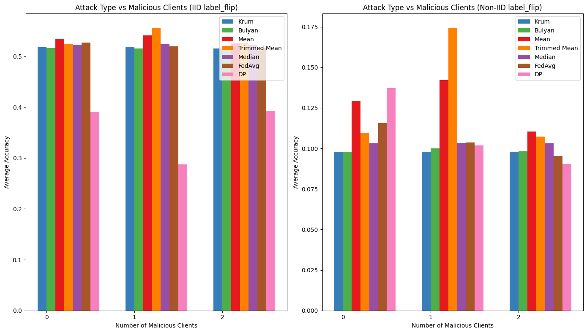
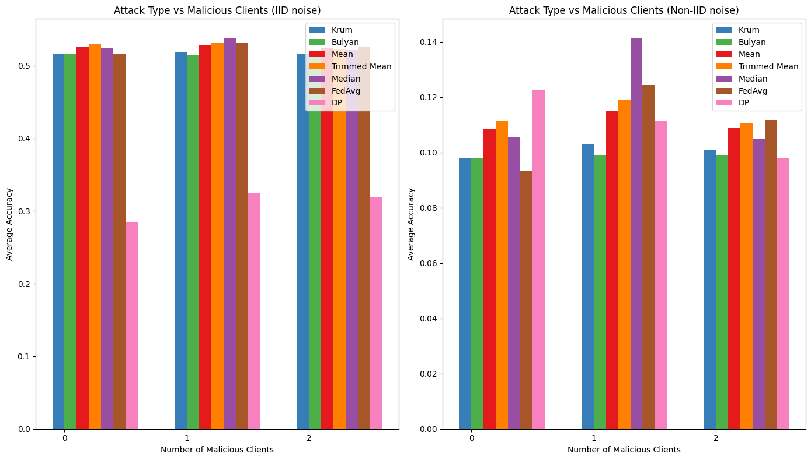
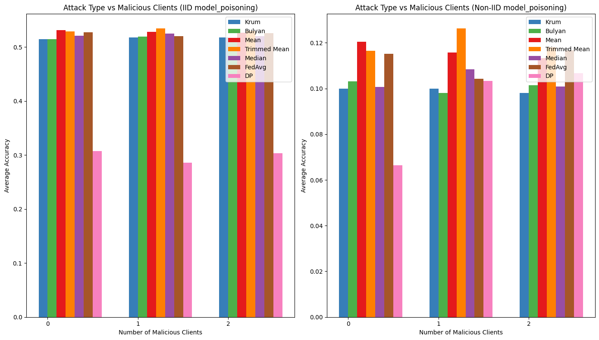
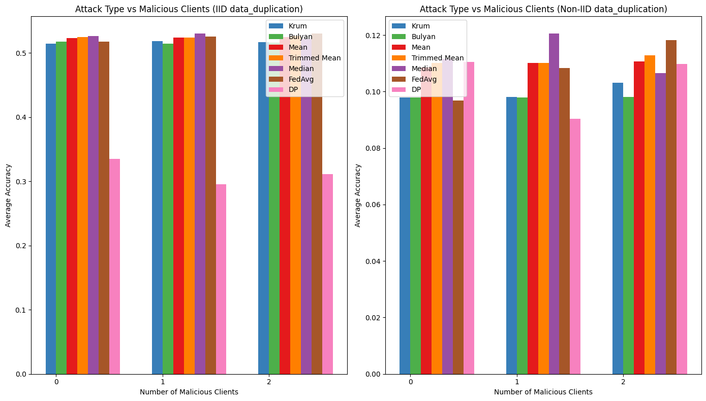

# Model Poisoning Attacks in Federated Learning 🔐

Federated Learning (FL) enables decentralized training across multiple clients without sharing raw data — a key enabler for privacy in **healthcare, finance, and edge IoT**.  
But FL is **vulnerable to model poisoning attacks**, where malicious participants manipulate updates to degrade or backdoor the global model.

This repository presents:

- A **systematic literature review** on poisoning attacks in FL.
- **Hands-on experiments** simulating key attack types.
- Insights on the role of **data heterogeneity (IID vs non-IID)** and **defense mechanisms**.

---

## 📌 Problem

- Traditional ML assumes centralized data, but FL relies on clients sending updates to a central server.
- **Malicious clients** can corrupt updates, either to:
  - ❌ Degrade overall accuracy (_untargeted attacks_).
  - 🎯 Introduce hidden backdoors (_targeted attacks_).
- Aggregation methods (FedAvg, Krum, Trimmed Mean, etc.) offer partial defense, but remain vulnerable under **non-IID settings**.

---

## 💡 Our Approach

1. **Systematic Literature Review**

   - Reviewed **42 papers** on poisoning attacks and defenses.
   - Analyzed **attack strategies, defenses, data/system heterogeneity, and research gaps**.

2. **Experiments**
   - Implemented **4 poisoning attack types**:
     - `label_flip.ipynb` → misclassifies labels.
     - `noise.ipynb` → injects random perturbations.
     - `model_poisoning.ipynb` → corrupts updates systematically.
     - `data_duplication.ipynb` → biases the global model.
   - Compared aggregation methods across **IID vs non-IID distributions**.

---

## 📊 Results

| Attack Type      | Observation                                                       |
| ---------------- | ----------------------------------------------------------------- |
| Label Flip       | Accuracy drops sharply under non-IID.                             |
| Noise Injection  | Some aggregators withstand mild noise, fail under stronger noise. |
| Model Poisoning  | Degrades both IID and non-IID performance significantly.          |
| Data Duplication | Biases the global model towards overrepresented classes.          |

### Example Result (Accuracy vs Malicious Clients)

_(Export figures from notebooks and save in `results/`)_

| Label Flip                           | Noise                           | Model Poisoning                           | Data Duplication                           |
| ------------------------------------ | ------------------------------- | ----------------------------------------- | ------------------------------------------ |
|  |  |  |  |

---

## 📂 Repository Structure

```
federated-learning-poisoning-attacks/
│── README.md
│── requirements.txt
│── notebooks/
│   ├── data_duplication.ipynb
│   ├── label_flip.ipynb
│   ├── noise.ipynb
│   └── model_poisoning.ipynb
│── results/                # save experimental plots here
│   ├── accuracy_label_flip.png
│   ├── accuracy_noise.png
│   ├── accuracy_model_poisoning.png
│   └── accuracy_data_duplication.png
│
|── slidedeck.pptx
│── .gitignore
```

---

## 🚀 How to Run

```bash
# clone repo
git clone https://github.com/<your-username>/federated-learning-poisoning-attacks.git
cd federated-learning-poisoning-attacks

# install dependencies
pip install -r requirements.txt

# run notebooks
jupyter notebook notebooks/
```

---

## 🎤 Presentation

For a visual walkthrough of findings and insights, see the presentation:  
👉 [slidedeck.pptx](slidedeck.pptx)

---

## 🔮 Future Work

- Explore **collusion of malicious clients**.
- Test defenses under **real-world non-IID datasets** (healthcare, finance).
- Investigate **fake client injection** in personalized FL systems.
- Develop defenses balancing **robustness vs accuracy trade-offs**.

---

## 📜 License

MIT License © 2025 Amrita Sinha Roy
